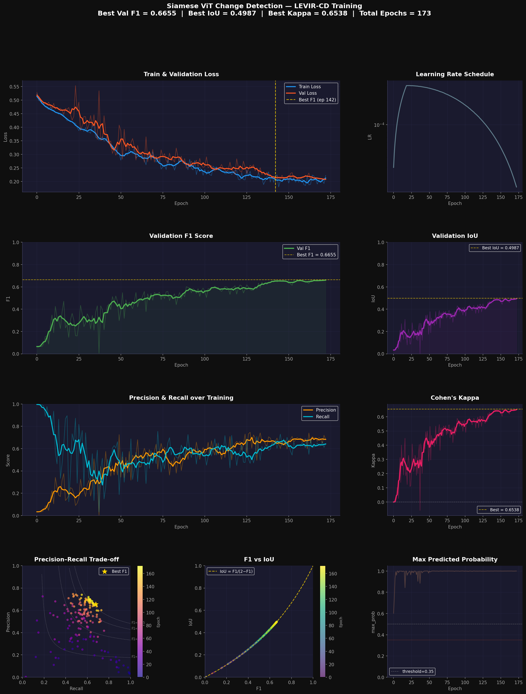

# Vision Transformer from Scratch for Urban Change Detection

## Project overview

This repository is a **hands-on study of Vision Transformers (ViTs)** built **from scratch in PyTorch**—patch embedding, multi-head self-attention, transformer blocks, and training loops—**without loading pretrained ViT weights**. The same building blocks are used in two settings:

1. **Bi-temporal change detection (main application)**  
   Two satellite images of the same place at two times are encoded with a **Siamese** backbone; features are compared and decoded into a **pixel-wise change mask**. Training targets the **LEVIR-CD** dataset (and tooling exists for related setups). Backbones include a **ViT-style encoder**, a **CNN U-Net** baseline, and a **Swin Transformer**-style encoder—so you can compare inductive biases and complexity under one training script.

2. **Image classification (pedagogy and ablations)**  
   A compact ViT is trained on **CIFAR-10** (`models/vit.py`, `configs/config.py`) to make attention maps, confusion matrices, and ablation studies tractable on a laptop or Colab. This path is about **understanding** attention and optimization; it is separate from the satellite pipeline.

If you read one idea from this file: a ViT turns an image into a **sequence of tokens**, runs **self-attention** so every token can attend to every other token, and stacks depth so **global context** is built without convolutions. For change detection, we run that idea **twice** (time 1 and time 2) and then ask **where the representations disagree**—that disagreement is turned into a map of “what changed.”

---

## Problem statement (change detection)

We observe two co-registered images of the same region:

- $X_{T1}$ — before (time 1)  
- $X_{T2}$ — after (time 2)

The goal is a binary **change map** at pixel resolution:

$$
Y \in \{0, 1\}^{H \times W}
$$

where $0$ means no change and $1$ means urban growth or other structural change of interest. This is **supervised semantic segmentation** with sparse positives: many pixels are “no change,” so losses and metrics are chosen to handle imbalance (see `utils/losses.py`, `utils/metrics.py`).

---

## Core math (what the code implements)

### Patch embedding

An image is a tensor $X \in \mathbb{R}^{H \times W \times C}$. It is split into non-overlapping patches of size $P \times P$, giving

$$
N = \frac{H}{P} \cdot \frac{W}{P}
$$

patches (for square images with divisible sizes, $N = HW / P^2$). Each patch is flattened to a vector in $\mathbb{R}^{P^2 C}$ and linearly projected to model dimension $D$. A learnable **[CLS]** token and **positional embeddings** are added so the model knows *which patch came from where*. In short: **tokens = projected patches + position information** (see `models/patch_embedding.py`).

### Multi-head self-attention (MHSA)

Stack all token embeddings into rows of a matrix $Z \in \mathbb{R}^{L \times D}$ (with $L = N$ or $N{+}1$ if a class token is used). For each head, linear maps produce

$$
Q = Z W_Q,\quad K = Z W_K,\quad V = Z W_V
$$

(with shapes chosen so each head operates in dimension $d_k = D / H_{\text{heads}}$). **Scaled dot-product attention** is

$$
\mathrm{Attention}(Q, K, V) = \mathrm{softmax}\left(\frac{Q K^\top}{\sqrt{d_k}}\right) V.
$$

The factor $\sqrt{d_k}$ keeps dot products from growing too large as dimension increases—without it, softmax would often saturate and gradients would vanish. Multiple heads let the model attend to **different types of relationships** in parallel; outputs are concatenated and projected back to $D$.

### Transformer encoder block (pre-norm, as in common ViT code)

Each block applies **LayerNorm → sublayer → residual** twice:

$$
Z' = Z + \mathrm{MHSA}(\mathrm{LN}(Z)), \qquad
Z_{\mathrm{out}} = Z' + \mathrm{MLP}(\mathrm{LN}(Z')).
$$

This **pre-norm** arrangement stabilizes training in deep stacks (the exact order in code is in `models/transformer_block.py`). Ablation variants (post-norm, no residual) live in the same module for coursework experiments.

---

## Architecture (how pieces map to folders)

**Change detection (`train.py`, `configs/train_*.yaml`):**

- **Siamese encoders** share weights: same backbone on $X_{T1}$ and $X_{T2}$.
- **Difference / fusion** combines multi-scale features (`models/feature_difference.py`).
- **Decoder** upsamples to full-resolution logits (`models/decoder.py`).
- Entry points: `models/siamese_vit.py`, `models/siamese_unet.py`, `models/siamese_swin.py`.

**Classification (`scripts/train_cifar10.py`, `utils/training.py`):**

- **ViT** → class logits; evaluation and plots in `utils/evaluation.py`, `utils/visualization.py`.
- Optional **ablation runner**: `scripts/run_ablations.py`.

High-level diagram (LEVIR pipeline):


---

## Repository layout (where to look)

| Path | Role |
|------|------|
| `train.py` | LEVIR-CD training: YAML + CLI; TensorBoard + checkpoints under `--output_dir`. |
| `configs/` | `train_config.yaml` (ViT CD), `train_unet_config.yaml`, `train_swin_config.yaml`; `config.py` holds **CIFAR ViT** hyperparameters (`ViTConfig`). |
| `models/` | Attention, patch embed, transformer blocks, decoders, Siamese assemblies, Swin building blocks. |
| `utils/` | Metrics, losses, **LEVIR-CD** dataloaders (`oscd_dataset.py`), **CIFAR-10** loaders and constants (`dataset.py`), training loop, evaluation, visualization. |
| `scripts/` | CIFAR training, ablations, plotting, prediction visualization helpers. |
| `slurm/` | Example batch scripts for cluster runs. |
| `outputs/` | **Change-detection** runs (logs, curves, figures); checkpoints are usually gitignored. |
| `results_cifar10/` | **CIFAR-10** figures (confusion matrix, attention tests); CLI runs also write under `outputs/train/results_cifar10/` by default. |

More detail: [docs/RESULTS_LAYOUT.md](docs/RESULTS_LAYOUT.md).

---

## Dataset: LEVIR-CD

The **LEVIR Change Detection (LEVIR-CD)** dataset provides **637** bi-temporal high-resolution Google Earth **pairs** for building-centric change detection.

- **GSD:** about **0.5 m** per pixel (very high resolution for Earth observation).
- **Tile size:** **1024 × 1024** RGB.
- **Labels:** pixel-wise binary masks (e.g., 0 / 255 for no-change / change).
- **Imbalance:** only a small fraction of pixels are “change,” which motivates focal / dice-style objectives and careful metrics.

**Official splits (pair counts):**

| Split | Pairs |
|-------|------|
| Train | 411 |
| Val   | 62 |
| Test  | 124 |

During training, **random 256×256 crops** are drawn from each 1024×1024 tile, which increases diversity each epoch without new downloads.

### Obtaining LEVIR-CD

Data are **not** vendored in this repo. Download separately, then point `--data_dir` at the root that contains `train/`, `val/`, and `test/` with aligned **A** (time 1), **B** (time 2), and **label** folders.

**Author page:** [LEVIR-CD](https://justchenhao.github.io/LEVIR/)

**Example mirrors (links may move):** search Kaggle for “LEVIR-CD”; some mirrors ship the classic 637-pair layout, others extended variants (e.g., LEVIR-CD+).

Expected layout:

```text
LEVIR CD/   (or any path you pass to --data_dir)
├── train/   A/  B/  label/
├── val/     A/  B/  label/
└── test/    A/  B/  label/
```

Example:

```bash
python train.py --data_dir "./LEVIR CD" --output_dir "./outputs/siamese_vit"
```

Use `--model vit|unet|swin` and a matching config file as needed; see `train.py --help` and the YAML files for defaults (image size, patch size, loss, schedule, etc.).

---

## CIFAR-10 path (classification ViT)

For **instruction and analysis**, the same conceptual ViT stack is trained on **CIFAR-10** (32×32 natural images, 10 classes):

```bash
python scripts/train_cifar10.py --epochs 200 --num-workers 4
```

Checkpoints and plots default to `outputs/train/checkpoints/` and `outputs/train/results_cifar10/` (or set `--output-dir`). Figures tracked under `results_cifar10/` in the repo are **static examples**; regenerate after training. **Ablations** without a notebook:

```bash
python scripts/run_ablations.py --ablation-epochs 50 --num-workers 4
```

---

## Evaluation metrics (change detection)

We report standard **segmentation** statistics: **IoU**, **F1**, **precision**, **recall**, **Dice**, and **Cohen’s kappa** where applicable—see `utils/metrics.py` for definitions. The decision **threshold** on predicted probabilities is important on imbalanced masks; it can be tuned on validation (example value used in the table below: **0.35**).

---

## Training results (example LEVIR-CD run)

Best validation performance after **173** epochs (representative run; your numbers will vary with seed and hardware):

| Metric    | Score  |
|-----------|--------|
| F1        | 0.6655 |
| IoU       | 0.4987 |
| Kappa     | 0.6538 |
| Threshold | 0.35   |

### Training curves

Loss, F1, IoU, precision/recall, Cohen’s kappa, learning-rate schedule, and precision–recall trade-offs over training:



---

## Prediction visualizations

Each row shows **8** randomly sampled validation crops that contain at least one positive (change) pixel:

| Column | Description |
|--------|-------------|
| Before (T1) | Pre-change satellite image |
| After (T2) | Post-change satellite image |
| Ground truth | Binary change mask (white = change) |
| Prob heatmap | Predicted probability of change |
| Prediction | Thresholded binary map |
| TP/FP/FN overlay | Green = correct change, red = false alarm, yellow = missed change |


---

## Results and outputs layout

- **`outputs/`** — LEVIR-CD **change-detection** experiments from `train.py` (TensorBoard events, `train.log`, curves, prediction grids). Subfolders such as `outputs/siamese_vit/`, `outputs/siamese_unet/`, `outputs/siamese_swin/` keep runs separated.
- **`results_cifar10/`** — **CIFAR-10 classification** artifacts (confusion matrices, attention / rollout figures from `scripts/train_cifar10.py` and `utils/evaluation.py`). The same directory name appears under `outputs/train/` when using the CLI (constant `CIFAR10_RESULTS_DIR` in `utils/cifar_paths.py`).

See [docs/RESULTS_LAYOUT.md](docs/RESULTS_LAYOUT.md) for regeneration commands.

---

## Tech stack

- **Python**, **PyTorch**, **Torchvision**
- **NumPy**, **OpenCV**, **Pillow**
- **Matplotlib**, **Seaborn**
- **scikit-learn** (e.g., t-SNE in visualizations)
- **Einops** (tensor reshapes where used), **Albumentations** (where used in pipelines)
- **PyYAML** (configs), **TensorBoard** (training logs)
- **rasterio** / **tifffile** (geospatial I/O where applicable)

Full pins: `requirements.txt`.

---

## Project goals

- **Understand** the ViT pipeline mathematically: patches → tokens → attention → depth.
- **Implement** attention, MLPs, and normalization **explicitly** (readable modules, not a black-box `nn.TransformerEncoder` for the educational path).
- **Apply** transformers to **remote-sensing change detection**, alongside **strong CNN and Swin baselines** in the same training framework.
- **Document** what each major directory and script is for, so a first-time reader can navigate the codebase with confidence.

---

## Course information

Submitted as part of a **Machine Learning** course project.
